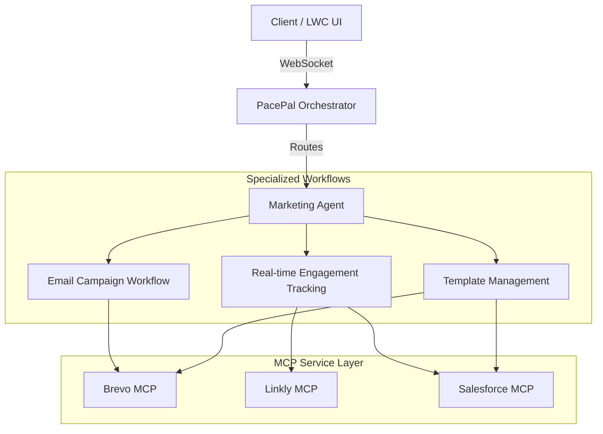

# #PacePal Aleena is creator🚀

**PacePal** is a state-of-the-art multi-agent AI orchestrator designed to automate marketing workflows. It seamlessly integrates with Salesforce, Brevo, and Linkly to provide a unified interface for managing campaigns, email delivery, and engagement tracking.

## 🌟 Key Features Ajay inited

- **Intelligent Orchestration:** A central coordinator that routes tasks to specialized agents (e.g., Marketing Agent).
- **Multi-Agent Architecture:** Modular agents built with **LangGraph** for complex, stateful workflows.
- **MCP Integration:** Native support for the Model Context Protocol (MCP) to interact with:
  - **Salesforce:** Perform SOQL queries, manage records, and update picklists via Tooling API.
  - **Brevo:** Create, preview, and send email campaigns.
  - **Linkly:** Shorten URLs and track real-time click engagement.
- **Flexible Deployment:** Supports both **Monolith** (all-in-one) and **Distributed** (independent agent servers) modes.
- **Interactive UI:** Integrated with Salesforce Lightning Web Components (LWC) for a premium user experience.

## 🏗️ Architecture

PacePal uses a hierarchical agent structure to handle complex marketing tasks.



## 🛠️ Tech Stack

- **Framework:** [FastAPI](https://fastapi.tiangolo.com/) (Asynchronous Python Web Framework)
- **Agent Logic:** [LangGraph](https://langchain-ai.github.io/langgraph/) / [LangChain](https://www.langchain.com/)
- **Protocol:** [Model Context Protocol (MCP)](https://modelcontextprotocol.io/)
- **Vector Search:** [ChromaDB](https://www.trychroma.com/) (for schema metadata)
- **Frontend:** Salesforce [LWC](https://developer.salesforce.com/docs/component-library/overview/components)

## 🚀 Getting Started

### Prerequisites

- Python 3.10+
- OpenAI API Key
- Salesforce Developer/Sandbox Org
- Brevo & Linkly API Keys

### Installation

1. **Clone the repository:**
   ```bash
   git clone <repository-url>
   cd PacePal-Agent
   ```

2. **Install dependencies:**
   ```bash
   pip install -r requirements.txt
   ```

3. **Configure Environment:**
   Create a `.env` file in the root directory and add your credentials:
   ```env
   OPENAI_API_KEY=your_key
   
   # Salesforce Credentials
   AGENT_SALESFORCE_USERNAME=...
   AGENT_SALESFORCE_PASSWORD=...
   AGENT_SALESFORCE_SECURITY_TOKEN=...
   
   # Marketing Credentials
   MARKETING_SALESFORCE_USERNAME=...
   MARKETING_SALESFORCE_PASSWORD=...
   ```

### Running the App

#### Monolith Mode (Development)
```bash
python pacepal/server.py
```
The server will start on `http://localhost:8001`.

#### Distributed Mode (Production)
```bash
# Terminal 1: Marketing Agent
export DEPLOYMENT_MODE=distributed
export MARKETING_PORT=8002
python agents/marketing/server.py

# Terminal 2: PacePal Orchestrator
export DEPLOYMENT_MODE=distributed
export MARKETING_AGENT_URL=http://localhost:8002
python pacepal/server.py
```

## 📋 Agent Workflows

### Marketing Agent
1. **Email Workflow:** Previews templates in Brevo, automatically shortens links via Linkly, sends the campaign, tracks delivery status, and logs activities back to Salesforce.
2. **Engagement Workflow:** Periodically fetches click data from Linkly and syncs engagement metrics to Salesforce records.
3. **Save Template Workflow:** Creates email templates in Brevo and updates Salesforce picklists via the Tooling API for seamless selection in the CRM.

## 📖 Documentation

- [Deployment Guide](DEPLOYMENT.md) - Detailed multi-server setup instructions.

---
Built with ❤️ by the PacePal Team.